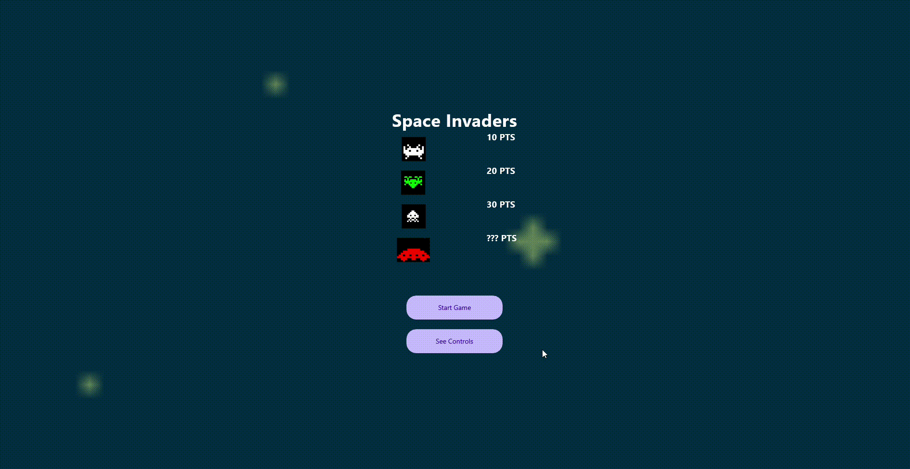

# Proyecto Final - Space Invaders 🚀

## Programación 3 - Grupo A

**Carrera:** Ingeniería de Software Comercial con Concentración en Diseño y Arquitectura\
**Universidad:** Jala University\
**Sección:** E\
**Faculty Practitioner:** Ludwin Rivera

---

## 🎮 Descripción del Proyecto

Este proyecto consiste en una recreación del clásico videojuego "Space Invaders" como una aplicación de escritorio en C# utilizando Uno Platform. Se implementaron elementos básicos del juego, como el movimiento del jugador, la capacidad de disparar y el desplazamiento de las naves alienígenas.

---

## 🎯 Objetivo del Proyecto

El objetivo de este desarrollo fue explorar la programación de videojuegos mediante el uso de componentes visuales interactivos, gestionar eventos para la interacción del usuario y aplicar principios de programación orientada a objetos.

---

## 🛠️ Tecnologías Utilizadas

- **Lenguaje:** C#
- **Framework:** Uno Platform (.NET 8)
- **Patrón de Diseño:** MVVM
- **IDE:** Visual Studio 2022
- **Control de Versiones:** GitLab

---

## 📂 Estructura del Proyecto

### **Models/** (Carpeta para Modelos)

📜 **PlayerShip.cs** → Representa la nave del jugador.\
📜 **EnemyShip.cs** → Clase base para los enemigos.\
📜 **BasicEnemy.cs, MediumEnemy.cs, AdvancedEnemy.cs** → Clases derivadas de EnemyShip.\
📜 **Bullet.cs** → Representa un disparo.

### **Presentation/** (Vistas)

📜 **GamePage.xaml** → Es la Vista (UI), define los elementos gráficos.\
📜 **GamePage.xaml.cs** → Code-behind de la Vista, solo maneja eventos de UI y delega la lógica al ViewModel.

### **ViewModels/** (Lógica del Juego)

📜 **GameViewModel.cs** → ViewModel, maneja la lógica del juego, control del jugador y enemigos.

### **Assets/** (Recursos gráficos)

📂 **Images/** → Contiene todas las imágenes del juego.

---

## ✅ Estado del Proyecto

| **Requisito**                   | **Estado**        |
| ------------------------------- | ----------------- |
| Movimiento del jugador          | ✅ Implementado    |
| Disparos del jugador            | ✅ Implementado    |
| Movimiento de naves alienígenas | ✅ Implementado    |
| Scoreboard funcional            | ❌ No implementado |
| Guardado de datos               | ❌ No implementado |
| Sonidos en eventos clave        | ❌ No implementado |
| Protección con bloques          | ❌ No implementado |
| Game Over por vidas o colisión  | ❌ No implementado |

---

## 📸 Capturas de Pantalla



---

## 🔧 Instalación y Ejecución

1. Clonar el repositorio desde GitLab:
   ```sh
   git clone [URL_DEL_REPOSITORIO]
   ```
2. Abrir el proyecto en **Visual Studio 2022**.
3. Restaurar dependencias y compilar el proyecto.
4. Ejecutar la aplicación.

---

## 👨‍💻 Autor

**Jhonathan Angarita**\
📧 **Correo:** [jhonathan.angarita@jala.university](mailto\:jhonathan.angarita@jala.university)\
🐙 **GitLab:** [@JhonathanAlejandroJalaU](https://gitlab.com/JhonathanAlejandroJalaU)


